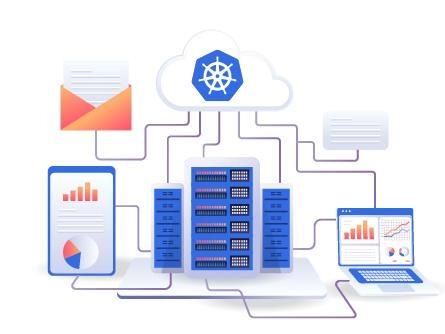

# Best Budget-Friendly Kubernetes VPS Hosting for 2025

Running containerized applications shouldn't break the bank. Whether you're a developer testing microservices or a startup scaling your infrastructure, affordable Kubernetes VPS hosting delivers enterprise-grade container orchestration without premium pricing. This guide reveals proven providers offering reliable performance, seamless scaling, and 24/7 support—all at prices that respect your budget.

---

**"My app works on my server. No clue why it won't run on yours."**

Sound familiar?

If container deployment headaches are slowing you down, it's time to embrace Kubernetes—the cloud-native orchestration platform that manages, scales, and maintains your containerized apps across any environment. No more "works on my machine" excuses.

Below, we've tested and ranked the top affordable Kubernetes VPS providers that combine budget-friendly pricing with rock-solid reliability.

## What Is Kubernetes VPS Hosting?

Think of Kubernetes VPS hosting as your automated container manager. It's VPS infrastructure pre-configured with Kubernetes—a framework that deploys, scales, and maintains those little software packages called containers (your app plus all its dependencies bundled together).

Instead of manually juggling containers across servers, Kubernetes handles the heavy lifting: load balancing, auto-scaling, self-healing when things crash, and keeping your apps running 24/7 regardless of traffic spikes.

## 9 Best Affordable Kubernetes VPS Providers for 2025

### 1. Kamatera – Enterprise-Grade Kubernetes at Startup Prices

Kamatera delivers cloud infrastructure built for serious workloads without the enterprise invoice. Their Kubernetes VPS includes a 30-day free trial, letting you test full production environments before committing a dollar.

What sets Kamatera apart is their pricing calculator—pay only for resources your containers actually need. No bundled bloat. Their cloud-native load balancers and block storage integrate seamlessly with Kubernetes deployments.

**Key Features:**
- Transparent hourly billing via usage calculator
- Integrated load balancers and persistent storage
- Live chat support with actual humans
- Instant resource scaling (upgrade/downgrade on the fly)

**Pricing:**
- **$4/month:** 1vCore CPU, 1GB RAM, 20GB NVMe SSD, 5TB bandwidth
- **$6/month:** 1vCore CPU, 2GB RAM, 20GB NVMe SSD, 5TB bandwidth

For teams managing dynamic workloads, Kamatera's flexibility matches Kubernetes' promise of adaptive infrastructure. When your containers need more resources during peak hours, you're not locked into fixed monthly plans.

👉 [Start your free Kamatera trial and deploy production-ready Kubernetes clusters today](https://www.vultr.com/?ref=9738262-9J)

### 2. DigitalOcean – Kubernetes Made Simple for Developers

DigitalOcean strips away unnecessary complexity. Their managed Kubernetes service handles cluster upgrades, security patches, and node maintenance automatically—you just deploy your containers and scale.

Perfect for developers who'd rather write code than babysit infrastructure. DigitalOcean's container registry integrates directly with their Kubernetes clusters, streamlining your CI/CD pipeline.

**Key Features:**
- Fully managed control plane (zero maintenance)
- One-click cluster deployment
- Built-in container registry
- Free SSL certificates and advanced DDoS protection
- 24/7 ticket and live chat support

**Pricing:**
- **$6/month:** 1vCore CPU, 1GB RAM, 25GB NVMe SSD, 1TB bandwidth
- **$18/month:** 2vCore CPU, 2GB RAM, 60GB NVMe SSD, 3TB bandwidth

New users get $200 in free credits—enough to run a small production cluster for months while you evaluate performance.

### 3. Vultr – High-Performance Kubernetes on Global Infrastructure

Vultr's one-click Kubernetes deployment gets you running in minutes across their 25+ global data centers. Their infrastructure prioritizes raw performance with NVMe storage and high-frequency CPUs.

Automatic cluster updates keep your Kubernetes version current without manual intervention. Security measures include DDoS mitigation and isolated networking for multi-tenant workloads.

**Key Features:**
- One-click Kubernetes installer
- Automatic security patches and updates
- 25+ global server locations
- Highly scalable node pools
- Round-the-clock technical support

**Pricing:**
- **$6/month:** 1vCore CPU, 1GB RAM, 25GB NVMe SSD, 2TB bandwidth
- **$24/month:** 2vCore CPU, 4GB RAM, 100GB NVMe SSD, 5TB bandwidth

Vultr includes $50 free credit for new accounts—perfect for testing containerized apps across different geographic regions.

If you're building globally distributed applications, Vultr's extensive data center network paired with affordable Kubernetes hosting makes deploying closer to your users straightforward and cost-effective.

👉 [Launch your Vultr Kubernetes cluster with $50 free credit and experience lightning-fast container orchestration](https://www.vultr.com/?ref=9738262-9J)

### 4. VPSServer – Reliable Kubernetes with 7-Day Free Trial

VPSServer offers straightforward Kubernetes VPS with a full week to test their platform risk-free. Their infrastructure emphasizes uptime guarantees and predictable performance.

**Key Features:**
- Maximum uptime SLAs
- One-click Kubernetes deployment
- 24/7 customer support
- Highly scalable resource allocation
- 7-day free trial (no credit card required)

**Pricing:**
- **$4/month:** 1vCore CPU, 1GB RAM, 20GB NVMe SSD
- **$13/month:** 2vCore CPU, 2GB RAM, 20GB NVMe SSD

### 5. Scaleway – Cloud-Native Kubernetes with Full Ecosystem

Scaleway provides complete cloud integration—VPC networking, persistent volumes, load balancers, container registry, and GPU support all work seamlessly with their managed Kubernetes.

**Key Features:**
- Auto-scaling node pools
- Self-healing infrastructure
- API/Terraform/CLI management
- Full cloud ecosystem integration
- Free trial available

**Pricing:**
- **$80/month:** 4GB shared RAM, includes load balancers and volume integration
- **$131/month:** 4GB dedicated RAM, complete infrastructure access

### 6. Contabo – Maximum Value Kubernetes VPS

Contabo delivers serious hardware specs at aggressive prices. Their 99.996% uptime commitment backs consistent performance for production workloads.

**Key Features:**
- 99.996% guaranteed uptime
- Advanced DDoS protection
- 24/7 technical support
- Simple Kubernetes installation

**Pricing:**
- **$4.21/month:** 3vCore CPU, 8GB RAM, 75GB NVMe SSD, 32TB bandwidth, 1 snapshot
- **$6.76/month:** 6vCore CPU, 12GB RAM, 200GB NVMe SSD, 2 snapshots

### 7. Rackspace – Fully Managed Enterprise Kubernetes

Rackspace handles everything: cluster management, automatic updates, security patching, and container orchestration. You focus entirely on your applications.

**Key Features:**
- Zero-touch infrastructure management
- Enterprise-grade security
- 24/7 expert support
- Multi-cloud Kubernetes support

**Pricing:** Contact sales for custom quotes

### 8. Linode (Akamai) – Developer-Friendly Kubernetes

Linode's marketplace simplifies Kubernetes deployment through their cloud manager. Their straightforward pricing calculator helps estimate costs before commitment.

**Key Features:**
- Marketplace one-click installation
- 24/7 specialized Kubernetes support
- Highly scalable infrastructure
- Transparent pricing calculator

**Pricing:**
- **$5/month:** 1vCore CPU, 1GB RAM, 25GB NVMe SSD, 1TB transfer
- **$12/month:** 1vCore CPU, 2GB RAM, 50GB NVMe SSD, 2TB transfer

### 9. Google Cloud – Battle-Tested Kubernetes at Scale

Google invented Kubernetes—their Google Kubernetes Engine (GKE) remains the gold standard. GKE handles cluster management completely, letting you focus on container deployment.

**Key Features:**
- Automated cluster management
- Free trial credits
- 24/7 enterprise support
- Global infrastructure

**Pricing:** Pay-as-you-go based on resource consumption

## How to Choose Your Kubernetes VPS Provider

### Resource Requirements
Calculate your expected workload, data volume, and performance needs before selecting a plan. Kubernetes itself requires minimal resources, but your containerized apps determine actual requirements.

### Global Data Centers
Choose providers with servers near your users. Lower latency improves application responsiveness—critical for real-time apps and APIs.

### Scalability
Ensure your provider supports instant resource scaling. Container workloads fluctuate; your infrastructure should adapt without manual intervention.

### Support Quality
Look for 24/7 technical support with actual Kubernetes expertise. When production clusters fail at 3 AM, generic support won't cut it.

### Security and Reliability
Verify providers offer DDoS protection, firewall configurations, malware scanning, and high uptime guarantees (99.9%+ minimum).

## Managed vs. Self-Managed Kubernetes

| **Managed Kubernetes** | **Self-Managed Kubernetes** |
|------------------------|----------------------------|
| Provider handles cluster maintenance | You manage everything yourself |
| Higher cost | Lower cost |
| Automatic updates and scaling | Manual configuration required |
| Ideal for teams without DevOps expertise | Best for experienced Kubernetes administrators |

## Frequently Asked Questions

**Which Kubernetes hosting is most reliable?**
Kamatera consistently delivers high uptime, scalable infrastructure, and responsive 24/7 support at competitive prices.

**Why is managed Kubernetes more expensive?**
You're paying for expert teams to handle cluster maintenance, security updates, scaling, and troubleshooting—freeing your developers to build applications instead of managing infrastructure.

**What's better: Docker or Kubernetes?**
They work together. Docker creates containers (packaged apps with dependencies), while Kubernetes orchestrates those containers across servers, handling scaling, load balancing, and recovery.

**Are cheap Kubernetes VPS plans limited?**
Not inherently. Budget plans typically mean self-managed infrastructure rather than limited resources. You handle configuration and maintenance yourself.

**What security should I implement?**
Essential protections include DDoS mitigation, firewall rules, SSL/TLS encryption, regular security patches, malware scanning, and continuous monitoring.

**Is anything better than Kubernetes?**
For container orchestration at scale, Kubernetes remains the industry standard. Its ecosystem, community support, and cloud-native architecture are unmatched.

---

## Conclusion

Kubernetes transformed how we deploy applications—and affordable VPS hosting made this enterprise technology accessible to everyone. Whether you're running microservices, scaling APIs, or managing complex distributed systems, the providers above deliver production-ready Kubernetes infrastructure without premium pricing.

Start with providers offering free trials (Kamatera, VPSServer, Scaleway) to test your workloads before committing. For most developers, managed solutions like DigitalOcean or Vultr eliminate operational overhead while maintaining budget-friendly costs. Your containers deserve reliable orchestration—now you can afford it.
